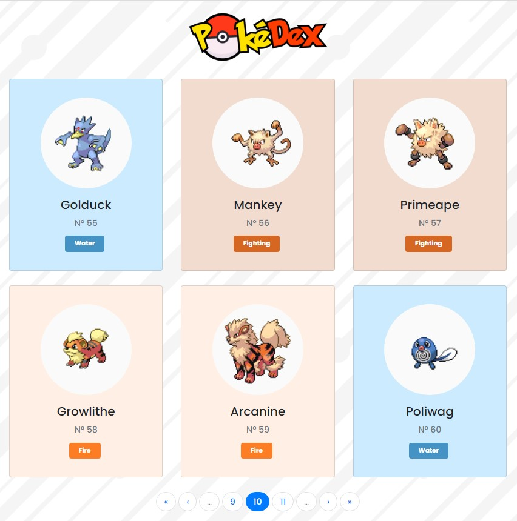

#### 💻 Projeto
O projeto foi realizado utilizando o VueJs e consumindo a api pública do Pokémon https://pokeapi.co para fazer uma PokéDex.

[Link para visualizar a aplicação](https://pokedex-vue-seven.vercel.app/)

#### 🚀 Tecnologias
Esse projeto foi desenvolvido com as seguintes tecnologias:

- [Vue](https://vuejs.org/)

Utilitários:

- [BootstrapVue](https://bootstrap-vue.org/)
- [PokeApi](https://pokeapi.co/)

#### 🎮 Rodar a aplicação
```bash

# Clone este repositório

# Acesse a pasta do projeto

# Instale as dependências utilizando npm install

# Execute a aplicação utilizando npm run serve

```

<p align="center">
  
</p>
